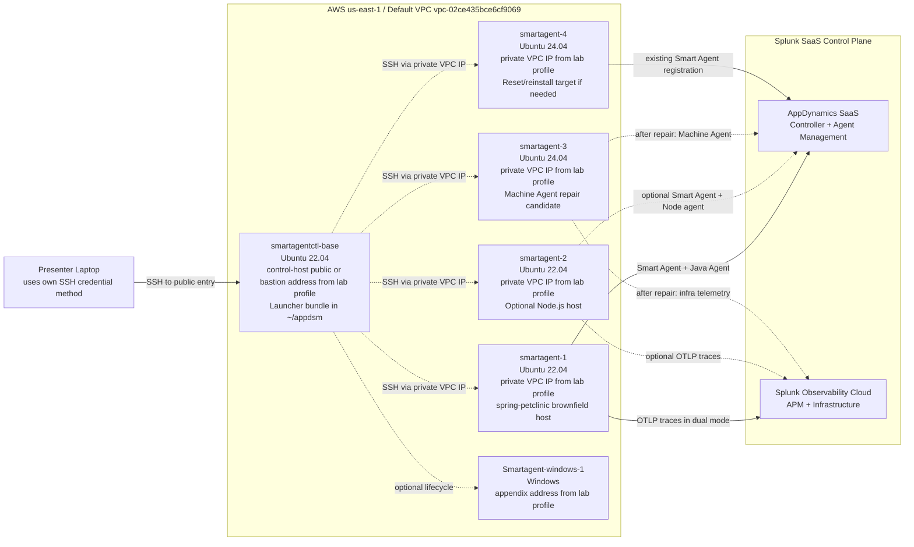

# Smart Agent Demo Architecture

Last updated: April 20, 2026

## Repeatable Entry Point

Use the repo-local `$smartagent-lab` skill in [skills/smartagent-lab](/Users/alecchamberlain/Documents/GitHub/smartagent_clus26/skills/smartagent-lab) as the procedural source of truth. This diagram stays as the visual reference.

## Summary

This lab is best presented as a brownfield lifecycle story. The control node holds the Smart Agent launcher bundle and `smartagentctl`. The managed Linux nodes are already enrolled and should be presented as private-VPC targets reached from that control node. One node hosts the Java `~/spring-petclinic` workload, one can host an optional Node.js demo, and one is reserved for infrastructure visibility after its stale Machine Agent service is repaired.

## Validated Live Notes

- The launcher bundle is in `/home/ubuntu/appdsm` on the control node.
- The managed Linux hosts run Smart Agent from `/opt/appdynamics/appdsmartagent`.
- `smartagent-1`, `smartagent-2`, and `smartagent-3` all contain `~/spring-petclinic`.
- `smartagent-4` is already managed, so it is a reset/reinstall target, not a fresh host.
- `appdynamics-machine-agent.service` is currently broken on the Linux app hosts because the expected binary is missing.
- The stale control-host `LD_PRELOAD` export was removed on April 20, 2026; fresh SSH logins should now be clean.
- The live ownership model is `username: ubuntu`, `privileged: true`, and managed-host Smart Agent runtime `root:root`.

## Mermaid Diagram

## Host Assignment

| Host | Purpose | Why It Matters |
| --- | --- | --- |
| `smartagentctl-base` | Launcher bundle and remote execution point | Shows centralized lifecycle control |
| `smartagent-1` | Java brownfield host | Shows attach and `AGENT_DEPLOYMENT_MODE` on a real app already on the host |
| `smartagent-2` | Optional Node.js host | Extends the same pattern to Node.js if the app is pre-staged |
| `smartagent-3` | Infra host pending repair | Good appendix story for stale brownfield services |
| `smartagent-4` | Reset/reinstall target | Useful if you want a rehearsed first-install story |
| `Smartagent-windows-1` | Optional appendix host | Useful for Q&A, not core flow |

## Control And Data Paths

- Laptop to control host: SSH using the audience’s available access method
- Control host to managed Linux nodes: SSH over private IPs via `remote.yaml`
- Smart Agent to AppDynamics SaaS: outbound `443`
- Java and optional Node dual-signal telemetry to Splunk Observability Cloud: OTLP over `443`
- Machine Agent infrastructure path: only after repair

Operator note:

- For this lab, managed-host operations should use the private VPC IPs from the control host to mirror the intended on-prem style access pattern.

## Naming Model To Highlight

- Smart Agent platform config: `SUPERVISOR_*`
- Runtime mode selection: `AGENT_DEPLOYMENT_MODE`
- OpenTelemetry identity and export: `OTEL_SERVICE_NAME`, `OTEL_RESOURCE_ATTRIBUTES`, `OTEL_EXPORTER_OTLP_*`
- Splunk destination shortcuts where supported: `SPLUNK_REALM`, `SPLUNK_ACCESS_TOKEN`

## Presentation Guidance

1. Explain that the current lab is already enrolled.
2. Use the diagram to show one launcher controlling many hosts.
3. Shift to the Java brownfield host as the core runtime story.
4. Keep Node optional unless prepared.
5. Keep Machine Agent out of the critical path until repaired.

## Notes

- `smartagentctl-base`, `smartagent-1`, and `smartagent-2` are Ubuntu 22.04.
- `smartagent-3` and `smartagent-4` are Ubuntu 24.04.
- Keep the exact current control-host and private-IP map in the copied lab profile or [current-lab.md](/Users/alecchamberlain/Documents/GitHub/smartagent_clus26/skills/smartagent-lab/references/current-lab.md).
