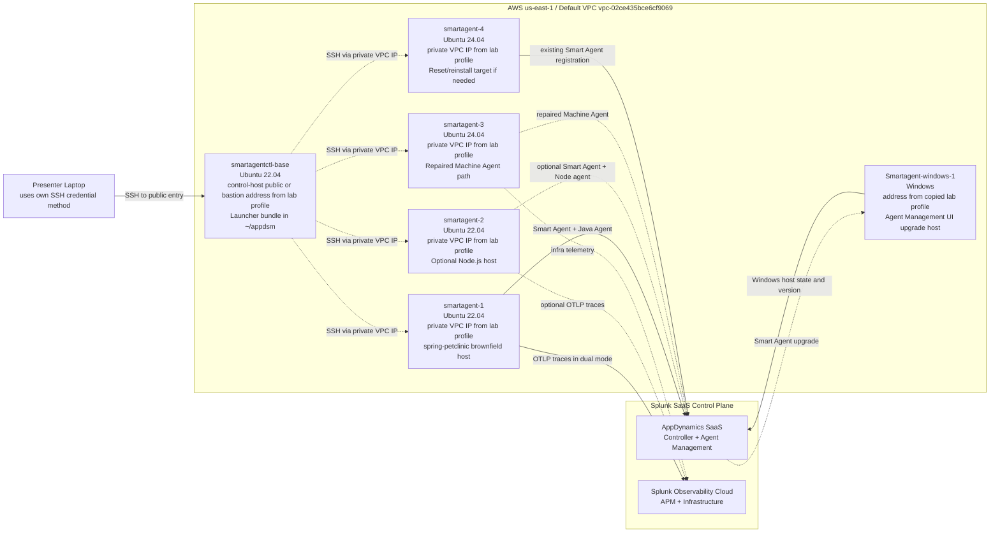

# Smart Agent Demo Architecture

Last updated: April 22, 2026

## Repeatable Entry Point

Use the repo-local `$smartagent-lab` skill in [skills/smartagent-lab](/Users/alecchamberlain/Documents/GitHub/smartagent_clus26/skills/smartagent-lab) as the procedural source of truth. This diagram stays as the visual reference.

## Summary

This lab is best presented as a brownfield lifecycle story. The control node holds the Smart Agent launcher bundle and `smartagentctl`. The managed Linux nodes are already enrolled and should be presented as private-VPC targets reached from that control node. One node hosts the Java `~/spring-petclinic` workload, one can host an optional Node.js demo, one is the repaired infrastructure path for Machine Agent visibility, and one Windows host is reserved for the opening Agent Management UI upgrade story.

## Validated Live Notes

- The launcher bundle is in `/home/ubuntu/appdsm` on the control node.
- The managed Linux hosts run Smart Agent from `/opt/appdynamics/appdsmartagent`.
- `smartagent-1`, `smartagent-2`, and `smartagent-3` all contain `~/spring-petclinic`.
- `smartagent-4` is already managed, so it is a reset/reinstall target, not a fresh host.
- `smartagent-3` now has a repaired `appdynamics-machine-agent.service`, and the infra path should stay gated by `validate_lab.sh --require-machine-agent`.
- The Windows host is intentionally pinned at `26.2.0-779` so the live UI move is an upgrade to `26.3.0-938`.
- The stale control-host `LD_PRELOAD` export was removed on April 20, 2026; fresh SSH logins should now be clean.
- The live ownership model is `username: ubuntu`, `privileged: true`, and managed-host Smart Agent runtime `root:root`.
- Linux and Windows Smart Agent packages are different; use the Linux ZIP for `smartagentctl --remote` on Linux hosts and the Windows ZIP plus `smartagentctl.exe` or Agent Management UI on Windows.

## Mermaid Diagram

## Host Assignment

| Host | Purpose | Why It Matters |
| --- | --- | --- |
| `smartagentctl-base` | Launcher bundle and remote execution point | Shows centralized lifecycle control |
| `smartagent-1` | Java brownfield host | Shows attach and `AGENT_DEPLOYMENT_MODE` on a real app already on the host |
| `smartagent-2` | Optional Node.js host | Extends the same pattern to Node.js if the app is pre-staged |
| `smartagent-3` | Infra host after Machine Agent repair | Brings infrastructure visibility into the same managed operating model |
| `smartagent-4` | Reset/reinstall target | Useful if you want a rehearsed first-install story |
| `Smartagent-windows-1` | Windows UI upgrade host | Opens the demo with a one-version Smart Agent upgrade from Agent Management instead of a remote desktop session |

## Control And Data Paths

- Laptop to control host: SSH using the audience’s available access method
- Control host to managed Linux nodes: SSH over private IPs via `remote.yaml`
- Agent Management to Windows host: open `Smart Agents`, select `Smartagent-windows-1`, and upgrade it from `26.2.0-779` to `26.3.0-938`
- Smart Agent to AppDynamics SaaS: outbound `443`
- Java and optional Node dual-signal telemetry to Splunk Observability Cloud: OTLP over `443`
- Machine Agent infrastructure path: make it a rehearsal gate once repaired, not an appendix hand-wave

Operator note:

- For this lab, managed-host operations should use the private VPC IPs from the control host to mirror the intended on-prem style access pattern.

## Naming Model To Highlight

- Smart Agent platform config: `SUPERVISOR_*`
- Runtime mode selection: `AGENT_DEPLOYMENT_MODE`
- OpenTelemetry identity and export: `OTEL_SERVICE_NAME`, `OTEL_RESOURCE_ATTRIBUTES`, `OTEL_EXPORTER_OTLP_*`
- Splunk destination shortcuts where supported: `SPLUNK_REALM`, `SPLUNK_ACCESS_TOKEN`

## Presentation Guidance

1. Explain that the current lab is already enrolled.
2. Use the diagram to show one launcher controlling many hosts.
3. Use Agent Management as the control-plane proof, beginning with the Windows Smart Agent upgrade path.
4. Shift to the Java brownfield host as the core runtime story.
5. Put `smartagent-3` on stage only after Machine Agent repair is validated.
6. Keep Node optional unless prepared.

## Notes

- `smartagentctl-base`, `smartagent-1`, and `smartagent-2` are Ubuntu 22.04.
- `smartagent-3` and `smartagent-4` are Ubuntu 24.04.
- Treat the Windows Smart Agents upgrade path and the `smartagent-3` repair as explicit go or no-go checks for the full live flow.
- Keep the exact current control-host and private-IP map in the copied lab profile or [current-lab.md](/Users/alecchamberlain/Documents/GitHub/smartagent_clus26/skills/smartagent-lab/references/current-lab.md).
